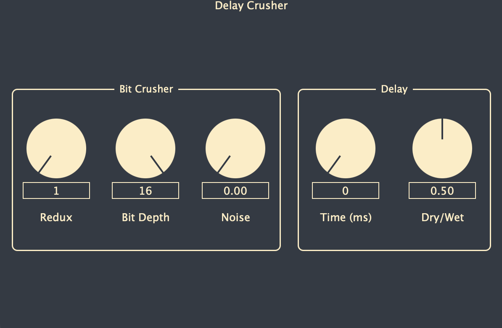

# Delay Crusher

<center>
    
</center>


Delay Crusher is a VST3 audio effect plugin that provides bit crushing and delay effects for music production. The plugin combines digital distortion with a delay to create lo-fi, retro, and experimental sounds.

## Features

- **Bit Crusher**: Reduce the bit depth and sample rate of audio
- **Noise Generator**: Add noise using Box-Muller Gaussian noise generation
- **Delay**: Time-based delay effect with dry/wet mixing

## Requirements

- CMake 3.24 or later
- Xcode Command Line Tools 26.2 (MacOS)
- Visual Studio 2026 Build Tools
- JUCE framework (included as a submodule)


## Building

Start by cloning the repository and initializing the JUCE submodule:

```
git clone --recurse-submodules https://github.com/Jacoab/DelayCrusher.git
```

### MacOS

```
cmake -B build -S . -G Xcode
cmake --build ./build --config Release
```
The built plugin will be located in `build/DelayCrusher_artefacts/Release/Delay Crusher.vst3`.

### Windows

Ensure you have Visual Studio Build Tools and CMake installed.

```
cmake -B build -S . -G "Visual Studio 18 2026" -A x64 -DCMAKE_BUILD_TYPE=Release
cmake --build ./build --config Release
```
The built plugin will be located in `build/DelayCrusher_artefacts/Release/VST3/DelayCrusher.vst3`.

## Testing

To run unit tests:

```
ctest --test-dir build -C Release -V
```


## Installing

### MacOS

The CMake build should automatically put the plugin into the correct directory. If the plugin does not appear, verify that it has been installed to the correct location:

```
ls ~/Library/Audio/Plug-Ins/VST3/DelayCrusher.vst3/Contents/MacOS
```

If the directory is not found, copy the built plugin to the standard VST3 location:

```
cp -r build/DelayCrusher_artefacts/Release/VST3/DelayCrusher.vst3 ~/Library/Audio/Plug-Ins/VST3/
```

After installation, the plugin will be available in any VST3-compatible DAW. You may need to re-scan the plugin directory in your DAW.

### Windows

Copy the built plugin to the standard VST3 directory:

```
xcopy /E /I build\DelayCrusher_artefacts\Release\VST3\DelayCrusher.vst3 "%ProgramFiles%\Common Files\VST3\"
```

After installation, the plugin will be available in any VST3-compatible DAW. You may need to re-scan the plugin directory in your DAW.
